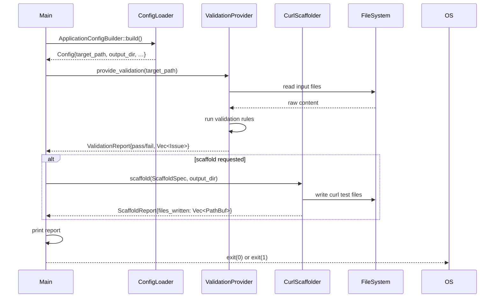
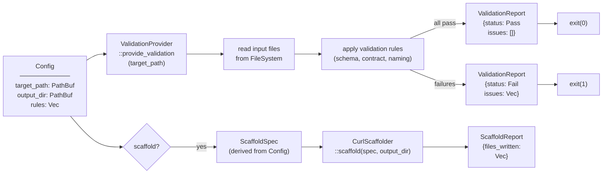

# Architecture — edge-cli

## Sequence

> The CLI loads `Config` from TOML, runs `ValidationProvider` over an input path, optionally scaffolds curl test files, and reports results.

## Data Flow

> A `Config` + filesystem path enter the CLI pipeline; a `ValidationReport` (and optional `ScaffoldReport`) exit.

